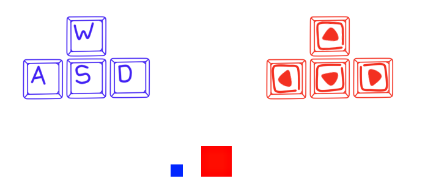

# Colisiones en Wollok
Este proyecto incluye una clase llamada "Colision" la cual usaremos para agregar a nuestros visuales un area de colision. Lo cual nos facilita la deteccion de las colisiones.

Con esto evitamos el uso de objetos invisibles para la deteccion de las mismas, lo que optimisa el rendimiento de nuestro juego ya que esta verificacion se hace a travez de formulas matematicas y no de visuales.

---
La implementacion de esta clase requiere que a nuestros visuales les añadamos dos atributos obligatorios mas, aparte de "image" y "Position".
Estos atributos son el alto y ancho de la imagen, o area de colision. Los cuales nombraremos como "heigth" y "width".

Entonces nuestro visual basico quedaria de la siguiente manera:

    object Pepita{
        var property image = "pepita.png"
        var property position = game.center()
        const property heigth = 20
        const property width = 20
    }

Estos, a diferencia de "image" y "Position", seran constantes, ya que no se modificaran a lo largo del juego.

---

Hay que tener en cuenta que a diferencia de los metodos nativos, este no verifica constantemente si se esta o no realizando la colision, por lo que tendriamos que añadir nosotros la verificacion en el momento que lo creamos oportuno, o con un bucle infinito que este verificando constantemente.

---
### Ejemplo
El proyecto incluye tambien un ejemplo para que puedan probar como funciona esta colision.
En donde tendremos dos cubos de diferentes tamaños, en un tablero con celdas de un pixel. En donde, si bien la imagen de los cubos es mucho mayor al tamaño de las celdas, la colision de detecta igualmente cuando uno pasa sobre otro.

